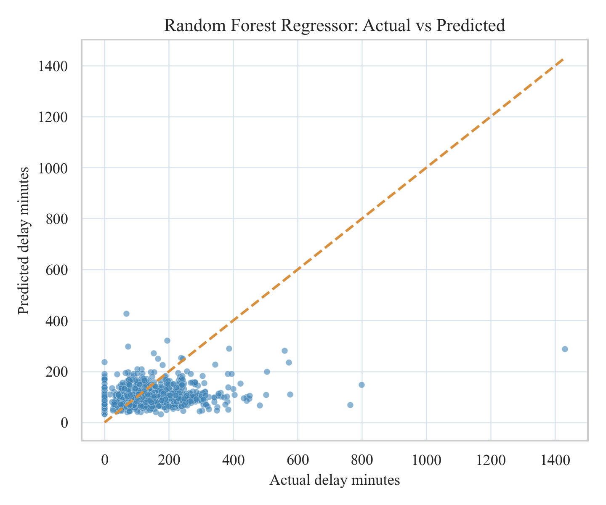

```{python}
import json
from pathlib import Path
import pandas as pd

root = Path(".")

daily = pd.read_csv(root / "data" / "processed_daily.csv", parse_dates=["date"])
tbl_weather = pd.read_csv(root / "outputs" / "table_weather_summary.csv")
tbl_reg = pd.read_csv(root / "outputs" / "table_regression_metrics.csv")
tbl_cls = pd.read_csv(root / "outputs" / "table_classification_metrics.csv")
tbl_imp = pd.read_csv(root / "outputs" / "table_feature_importance_regression.csv")
key = json.loads((root / "outputs" / "key_numbers.json").read_text(encoding="utf-8"))

n_days = key["n_days"]
start_date = key["start_date"]
end_date = key["end_date"]
severe_threshold = key["severe_threshold"]
best_reg_model = key["best_reg_model"]
best_reg_rmse = key["best_reg_rmse"]
best_reg_r2 = key["best_reg_r2"]
best_cls_model = key["best_cls_model"]
best_cls_auc = key["best_cls_auc"]
best_cls_f1 = key["best_cls_f1"]
```

# Introduction

Public transit reliability is a daily quality-of-life issue in Toronto, especially when weather conditions deteriorate. The Toronto Transit Commission (TTC) carries more than one million riders per day, and even moderate delays can create wide social and economic costs through missed connections, longer commute times, and reduced service confidence.

This project examines how weather conditions are associated with TTC subway delay burden at the daily level. The analysis extends the midterm topic and narrows scope to the elements required for the final project: reproducible data acquisition, feature engineering, regression and classification modeling, and communication through publication-ready outputs plus interactive visualizations.

The specific research questions are:

1. How strongly are precipitation and weather severity associated with daily total delay minutes?
2. Which engineered weather features are most predictive of delay burden?
3. Can we accurately classify whether a day is a **severe delay day** (top quartile of delay minutes)?

The working hypotheses are:

- Higher precipitation and snowfall are positively associated with total delay minutes.
- Weather effects are amplified on weekdays due to higher passenger load.
- A machine-learning classifier using engineered weather features can identify severe-delay days with practically useful discrimination.

# Methods

## Data Sources

Two data streams were acquired programmatically:

1. **Weather data (Open-Meteo archive API):** Daily weather records for Toronto (2014-01-01 to 2026-03-31), including precipitation, snowfall, temperature, and wind variables.
2. **TTC subway delay data (Toronto Open Data CKAN API):** Incident-level delay records across multiple historical CSV/XLS/XLSX resources from package `ttc-subway-delay-data`.

All source calls are made inside `scripts/final_pipeline.py`, and output files are regenerated from scratch when the pipeline is rerun.

## Data Wrangling and Feature Engineering

The TTC files use inconsistent column names across years. The pipeline applies flexible column detection for date and delay fields, then standardizes to incident-level schema:

- `date`
- `min_delay`
- optional `line`, `station` (when available)

Records are filtered to valid numeric delay values and aggregated to daily totals:

- `total_delay_mins` (sum of incident delay minutes)
- `total_incidents` (incident count)
- `median_incident_delay`

Weather and TTC daily data are merged by date (inner join). The final analysis table contains `{python} n_days` days from `{python} start_date` to `{python} end_date`.

Engineered predictors include:

- `mean_temp_c` (daily average of max/min temperature)
- `precip_intensity` (precipitation per active precipitation hour)
- `weather_type` (Clear / Light Rain-Snow / Heavy Rain-Snow)
- `is_weekend_int`
- calendar features (`month_num`, `day_of_week`)

The classification target is:

- `severe_day = 1` if daily delay is at or above the 75th percentile threshold (`{python} round(severe_threshold, 2)` minutes), else 0.

The 75th-percentile cutoff is used as a pragmatic high-risk threshold for classification; regression results are reported in parallel to avoid over-reliance on a single binary definition of severity.

## Modeling Strategy

Two modeling tasks were implemented.

### Regression

Predicting continuous `total_delay_mins` on a 70/30 train-test split:

- Baseline: Linear Regression
- Main model: Random Forest Regressor

Metrics: R², RMSE, and MAE.

### Classification

Predicting binary `severe_day` on a stratified 70/30 split:

- Baseline: Logistic Regression (with standardization)
- Main model: Random Forest Classifier

Metrics: Accuracy, Precision, Recall, F1, ROC-AUC.  
Model interpretation includes feature-importance diagnostics.

# Results

## Descriptive Patterns

{#fig-monthly width=85%}

Figure 1 shows clear long-run co-movement between precipitation load and monthly delay burden. While seasonality exists, delay peaks are not purely calendar-driven; they align with high precipitation periods.

{#fig-weather-box width=78%}

Figure 2 confirms monotonic separation across weather severity categories: heavier weather conditions correspond to higher median delay and greater spread.

```{python}
#| label: tbl-weather
#| tbl-cap: "Daily delay summary by weather category."
tbl_weather
```

Table 1 quantifies this visual pattern. Heavy weather days have the highest average and median delay burden, supporting the first hypothesis.

## Regression Performance

```{python}
#| label: tbl-reg
#| tbl-cap: "Regression model comparison on the held-out test set."
tbl_reg.round(4)
```

`{python} best_reg_model` is the best-performing regression model on RMSE, with RMSE `{python} round(best_reg_rmse, 2)` and R² `{python} round(best_reg_r2, 3)`. This indicates materially better predictive fit than a purely linear specification.

{#fig-rf-actual-pred width=72%}

Figure 3 shows generally good calibration with expected underprediction at the highest tail values, a common behavior for tree ensembles under severe outlier conditions.

```{python}
#| label: tbl-importance
#| tbl-cap: "Top weather predictors of delay (Random Forest regression feature importance)."
tbl_imp.head(8).round(4)
```

Feature importance results emphasize precipitation-related variables, along with wind and temperature. This aligns with operational intuition that extreme moisture and wind conditions increase infrastructure stress and service disruption risk.

## Severe-Delay Classification

```{python}
#| label: tbl-cls
#| tbl-cap: "Classification model comparison for severe-delay-day detection."
tbl_cls.round(4)
```

`{python} best_cls_model` achieves the best discrimination with ROC-AUC `{python} round(best_cls_auc, 3)` and F1 `{python} round(best_cls_f1, 3)`, indicating meaningful classification performance on the severe-day task.

{#fig-roc width=72%}

The ROC comparison shows consistent improvement of the Random Forest classifier over logistic regression in separating severe from non-severe days.

Together with Table 4, the ROC analysis indicates a practical classification signal for identifying weather-linked high-risk service days.

# Conclusions and Summary

This final analysis provides a reproducible, model-driven answer to the weather-delay question:

1. Adverse weather, especially precipitation-heavy conditions, is strongly associated with increased TTC subway delay burden.
2. Engineered weather features deliver better predictive performance in non-linear models than in linear baselines.
3. Severe-delay-day classification is feasible with practical ROC-AUC/F1 performance, supporting risk-oriented transit planning use cases.

In the broader picture, these findings suggest value in weather-conditioned operations planning: pre-positioning maintenance teams, adjusting service buffers on high-risk days, and issuing rider-facing alerts earlier.

## Limitations

- Daily-level aggregation can hide intra-day dynamics (e.g., rush-hour clustering).
- Historical TTC files are heterogeneous and require robust but imperfect column harmonization.
- Station-level geospatial analysis is only partially supported by fields available across all years.
- Causal interpretation is limited; the models are predictive/associational rather than causal.
- Severe-day classification depends on the selected percentile cutoff; threshold choice may shift precision/recall trade-offs.

## Next Steps

- Expand to hourly models when high-resolution incident timestamps are consistently available.
- Add exogenous operational factors (special events, planned maintenance, service level changes).
- Integrate uncertainty bands into operational forecasting outputs.

For interactive exploration of the same dataset, see the **Interactive Visualizations** page on the project website.
