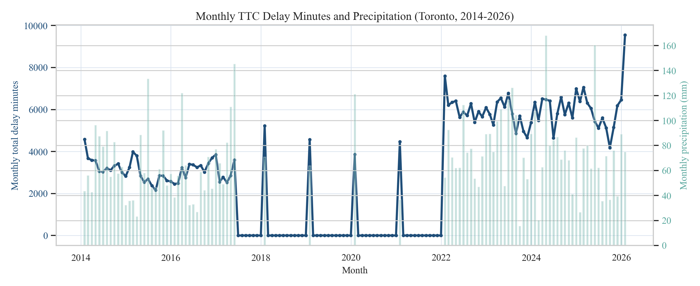
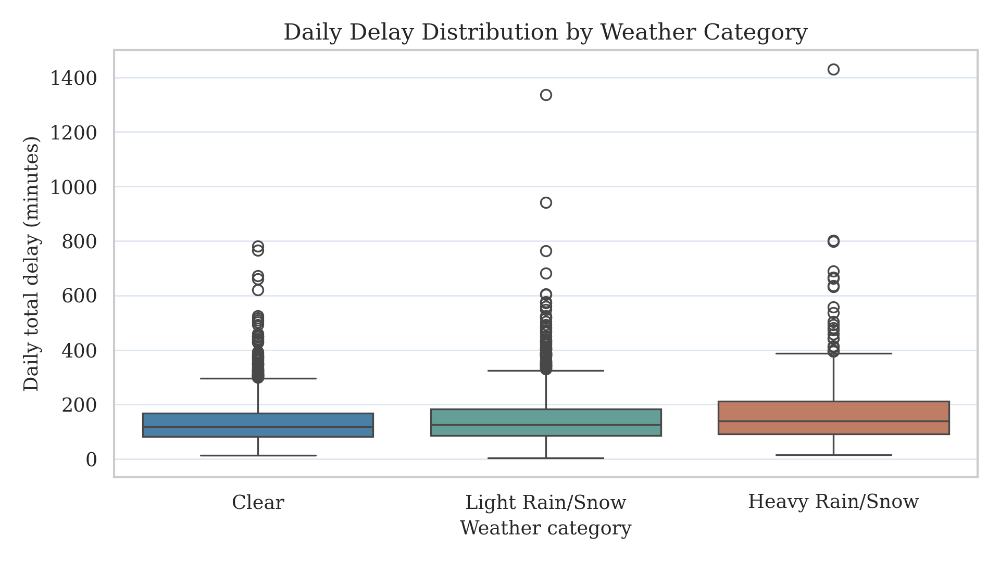
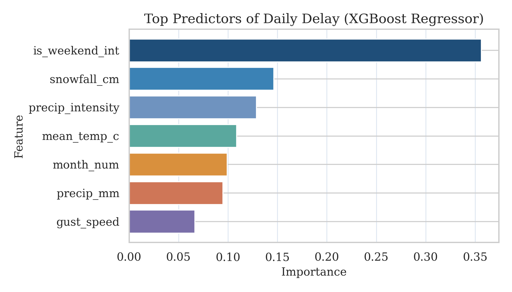
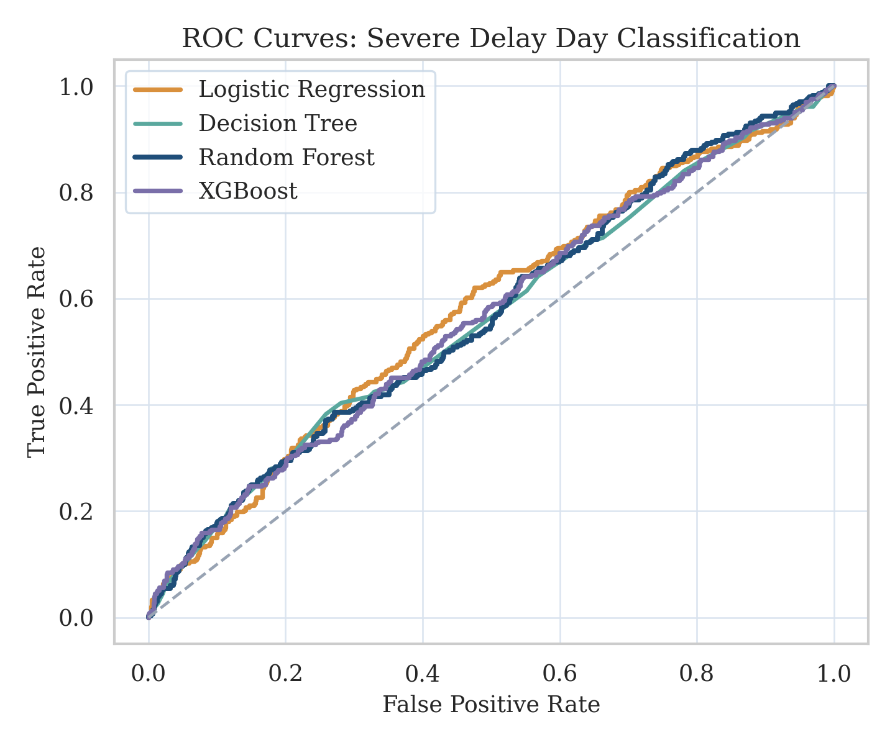
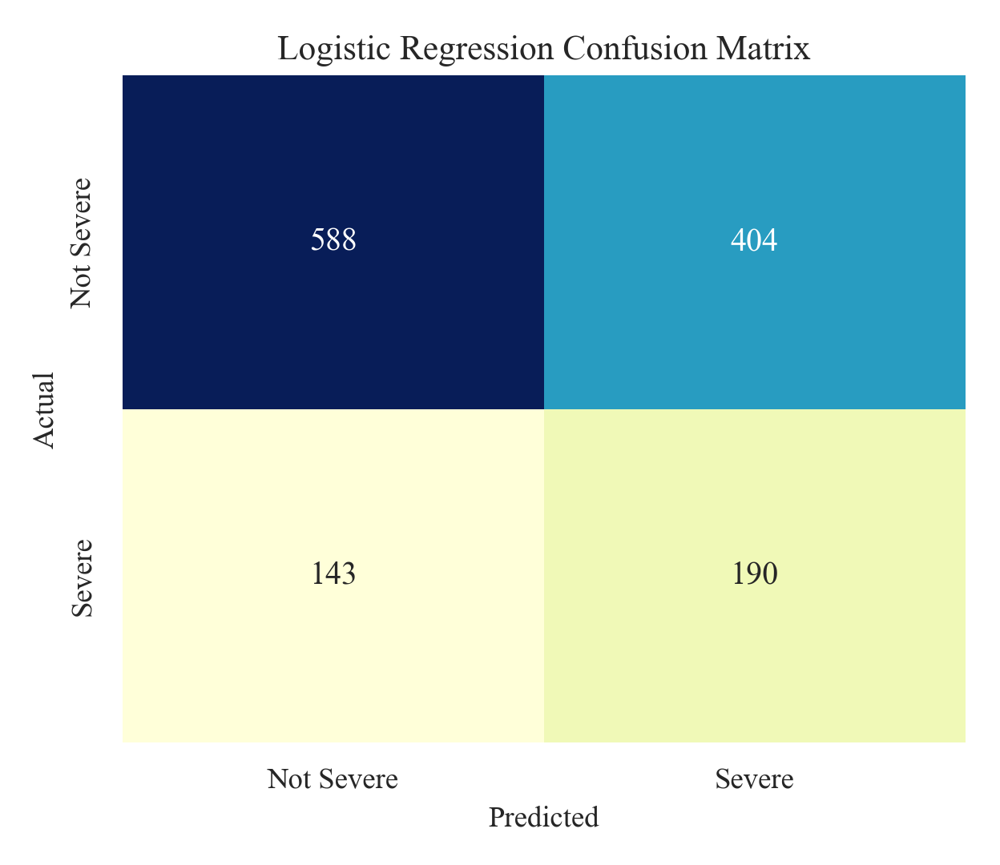

```{python}
import json
from pathlib import Path
import pandas as pd

root = Path(".")
key = json.loads((root / "outputs" / "key_numbers.json").read_text(encoding="utf-8"))
tbl_reg = pd.read_csv(root / "outputs" / "table_regression_metrics.csv")
tbl_cls = pd.read_csv(root / "outputs" / "table_classification_metrics.csv")

rf_rmse = float(tbl_reg.loc[tbl_reg["model"] == "Random Forest Regressor", "rmse"].iloc[0])
lin_rmse = float(tbl_reg.loc[tbl_reg["model"] == "Linear Regression", "rmse"].iloc[0])
rf_auc = float(tbl_cls.loc[tbl_cls["model"] == "Random Forest Classifier", "roc_auc"].iloc[0])
logit_f1 = float(tbl_cls.loc[tbl_cls["model"] == "Logistic Regression", "f1"].iloc[0])
rmse_gain_pct = (lin_rmse - rf_rmse) / lin_rmse * 100
```

# Research Focus

## Question

How strongly do adverse weather conditions explain day-level TTC subway delay burden in Toronto?

## Goals

- Build a reproducible API-based dataset (2014-2026)
- Compare regression and classification models
- Identify top weather predictors of severe-delay days
- Deliver interactive results for exploration

::: notes
Open with motivation: transit reliability affects daily quality of life.
Define severe day as top quartile of delay minutes.
:::

---

# Data and Pipeline

- **Weather API:** Open-Meteo daily archive
- **Transit API:** Toronto Open Data CKAN (`ttc-subway-delay-data`)
- Multi-file TTC ingestion with robust column harmonization
- Daily-level merge and engineered weather features
- Reproducible pipeline: `scripts/final_pipeline.py`

::: notes
Mention flexible parsing across historical TTC files and no hard-coded local paths.
:::

---

# Core Features

- Precipitation (`precip_mm`)
- Snowfall (`snowfall_cm`)
- Wind gust speed (`gust_speed`)
- Mean temperature (`mean_temp_c`)
- Precipitation intensity (`precip_intensity`)
- Weekend indicator and month seasonality

**Classification target:** Severe-delay day = top 25% of daily delay totals.

::: notes
Connect features to operational mechanisms: moisture, wind, and temperature stress.
:::

---

# Descriptive Signal

{width=92%}

Delay burden and precipitation co-move at monthly scale; the 2017-2021 low/zero segment reflects sparse incident-record coverage rather than literal zero delays.

---

# Weather Severity Effect

{width=76%}

Heavy rain/snow days show higher median delay and wider extreme tail.

---

# Modeling Results

## Regression (held-out)
- Best RMSE: Random Forest = `{python} round(rf_rmse, 2)`
- RMSE gain vs Linear: `{python} round(rmse_gain_pct, 2)`%

## Classification (held-out)
- Best ROC-AUC: Random Forest = `{python} round(rf_auc, 3)`
- Best F1: Logistic Regression = `{python} round(logit_f1, 3)`

{width=64%}

Precipitation and weather-stress variables dominate predictive importance.

---

# Severe-Day Classification

{width=62%}
{width=34%}

Random Forest improves discrimination and keeps balanced detection under class imbalance.

---

# Conclusion

- Weather is a meaningful (not dominant) predictor of TTC daily delay burden.
- Non-linear models improve ranking/discrimination, but effect sizes are moderate.
- Severe-delay-day prediction is useful for risk prioritization, not deterministic day-level certainty.
- Interactive visuals and full reproducible pipeline are published on the project website.

## Thank you

Project pages:
- Report (`report.html` / `report.pdf`)
- Interactive visuals (`viz.html`)
- Code + pipeline (`scripts/final_pipeline.py`)
